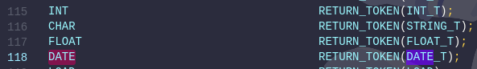
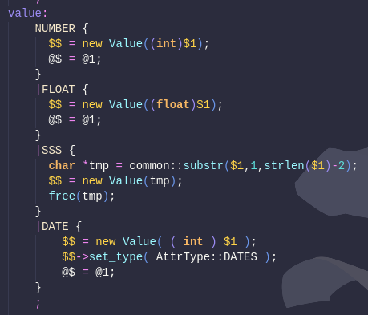

###### MiniOB-2022 训练营 

# 3. date

实现日期类型的字段,测试可能超过2038年2月，也可能小于1970年1月1号. 实现的思路是对年,月,日分别按位存储,即从0年0月0日开始的时间戳,那么一个32位的整型即可存下一个日期.

具体的32位时间戳格式参照如下

```
**** **** **** **** | **** **** **** ****
0000 0000 0YYY YYYY | YYYY YYYM MMMD DDDD
```
采用14位存储最大16383的年份(实际只需要到9999),采用4位存储最大15的月份(实际只需要到12),采用5位存储最大31的日. 

实现一个数据类型最基本要考虑三种SQL语句:

- create table 
- insert 
- select 

接下来对MiniOB实现这三个语句与数据类型实现的联系作解析.

### I. create table

create table语句在编译时,应经过词法分析获得表中字段类型信息. 因而我们需要增加匹配规则DATE



但在create table时此处返回的TOKEN显然不是DATE类型的值,而是一个DATE类型的声明,因此我们需要返回DATE_T表示这是一个type,这个TOKEN在gen_parse后,由lex自动帮我们生成对应的yytokentype枚举


接下来yacc会根据create table的语法生成table的结构体, 注意此时应在yacc让DATE_T这一yytokentype枚举转换成内部的数据类型的枚举AttrType, 这一枚举在value.h中. 我们需要在这里增加DATES的枚举. 


然后在yacc读取到type的词法时,将DATES返回


parse stage之后是resolve stage,这一stage实际上只是将table meta的结构体转换成一个类的实例,并没有做什么特别的事情. 接着是optimize stage, create table不需要optimize, 因而我们直接跳到execute stage. 

事实上table的元数据保存在\<table_name\>.table文件中, 并且以json格式存储. 原来的枚举信息已经丢失, 转而采用类型本身的名字来存储. 这一实现在FeildMeta类的to_json(). 


看到FeildMeta::to_json()实际上调用了attr_type_to_string()来获取枚举本身的名字, 实际上, 这一函数位于Value.cpp. 我们需要增加自己的枚举名到数组中, 注意枚举值与其对应的枚举名所在数组下标相同. 


如果这里不做修改, 那么table meta将会保存unknown的数据类型, 导致下次打开MiniOB时读取table meta异常. 

### II. insert 

insert语句主要修改的地方是如何识别插入的字符串是日期. 这里考虑这样去实现: 由于lex返回的是词素, 因而对于一个字符串, 我们在lex中就把具有日期格式的字符串hash成时间戳, 并且判断是否是合法的日期, 一旦不合法就当成普通字符串处理. 


其中用到的YEAR, MONTH, DAY正则宏定义在前面 


对疑似date的字符串进行hash的函数如下, 这一函数还包括检测日期合法性的功能. 函数返回日期是否合法, 将hash结果保存在引用参数hash中, 如果不合法, int hash的值默认为0. 

```cpp
bool hash_date( const char *date, int &hash)
{
	int year = 0;
	bool leap = false;
	int month = 0;
	int day = 0;
	int index = 1;
	char cur = date[1];
	hash = 0;

	// year 
	while ( cur != '-' )
	{
		year *= 10;
		if ( is_number( cur ) )
			year += char_to_int( cur );
		else
			return false;
		++index;
		cur = date[index];
	} // judge leap year
	if ( year % 4 == 0 )
		leap = true;
	if ( year % 100 == 0 )
		leap = false;
	if ( year % 400 == 0 )
		leap = true;
	++index;
	cur = date[index];

	// month 
	while ( cur != '-' )
	{
		month *= 10;
		if ( is_number( cur ) )
			month += char_to_int( cur );
		else 
			return false;
		++index;
		cur = date[index];
	} // judge invalid month 
	if ( month > 12 || month < 1 )
		return false;
	++index;
	cur = date[index];

	// day 
	while ( cur != '\"' )
	{
		day *= 10;
		if ( is_number( cur ) )
			day += char_to_int( cur );
		else 
			return false;
		++index;
		cur = date[index];
	} // judge invalid day 
	if ( day < 1 )
		return false;
	switch ( month )
	{
		case 2:
		{
			if ( day > ( ( leap ) ? 29 : 28 ) )
				return false;
			else 
				break; 
		}
		case 4:
		case 6:
		case 9:
		case 11:
		{
			if ( day > 30 )
				return false;
			else 
				break;
		}
		default:
			break;
	}

	hash = ( year << 9 ) + ( month << 5 ) + day;
	return true;
}
```
注意这个函数定义在lex的第二个%%中, 不要忘记在第一个%%前面做函数声明. 

这样, 如果是一个合法的日期, 在yacc中获得的词素将是时间戳, 而不再是字符串, 这样可以简化后续我们对日期的许多操作, 例如日期数据的保存,比较等. 

在MiniOB中, 每一个数据在内存中都是一个Value对象, 在yacc中会把lex分析出的数据值保存在Value对象中, 不过此处我们可以直接把date类型当成int类型存储. 但是不要忘记设置Value的type为DATES. 



事实上到此为止, insert对date类型的兼容已经完成了. 

### III. select

在此, 我们暂时考虑select * from \<table_name\>的简单情况 

此处的关键其实在于当数据被select出来后, 如何与client交互, 或者说, 如何将时间戳还原成字符串显示到client上. 就这一点来说, 我们其实只需关心把结果写回到client的时机. 

这一时机在PlainCommunicator::wirte_result_internal()中, 这个函数比较复杂, 经过一番分析, 在写回结果之前, 拿到表中的数据时, 会拷贝一份Value, 然后调用Value的to_string()将数据值转换成字符串, 这就是我们需要修改的地方. 

首先是拷贝Value时调用了Value::set_data()

```cpp
void Value::set_data( char *data, int length )
{
	switch ( attr_type_ )
	{
		case CHARS:
		{
			set_string( data, length );
		} break;
		case DATES:
		{
			num_value_.int_value_ = *( int * ) data;
			length_ = length;
		} break;
		case INTS:
		{
			num_value_.int_value_ = *( int * ) data;
			length_ = length;
		} break;
		case FLOATS:
		{
			num_value_.float_value_ = *( float * ) data;
			length_ = length;
		} break;
		case BOOLEANS:
		{
			num_value_.bool_value_ = *( int * ) data != 0;
			length_ = length;
		} break;
		default:
		{
			LOG_WARN( "unknown data type: %d", attr_type_ );
		} break;
	}
}
```

我们需要在其中增加一个DATES的case. 

从健壮性考虑, Value::set_value(), Value::compare()也最好做相应的修改. 

接着在真正写回结果时, 会调用Value::to_string(), 因此我们需要在其中也添加DATES的case, 将对时间戳反哈希, 得到日期字符串. Value::dehash_date()定义如下

```cpp
std::string Value::dehash_date() const
{
	int year;
	int month;
	int day;

	day = ( num_value_.int_value_ >> 0 ) & 0x1F;
	month = ( num_value_.int_value_ >> 5 ) & 0xF;
	year = ( num_value_.int_value_ >> 9 ) & 0x3FFF;

	std::string str = "";
	if ( year < 10 )
		str += "000";
	else if ( year < 100 )
		str += "00";
	else if ( year < 1000 )
		str += "0";
	str += std::to_string( year );
	str += "-";
	if ( month < 10 )
		str += "0";
	str += std::to_string( month );
	str += "-";
	if ( day < 10 )
		str += "0";
	str += std::to_string( day );
	return str;
}
```
