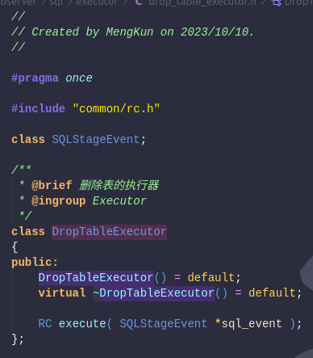
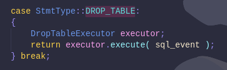

###### MiniOB-2022 训练营 

# 4. drop table

再考虑删除表之前, 我们需要了解MiniOB是如何存储数据库和表的, 接着再考虑如何删除磁盘上的相关数据, 最后还需要考虑由于原来的表已经在内存中打开, 我们需要清空缓存. 

## I. 表在磁盘中的存在形式

在前面编译DBMS的时候, 输出会放在build_debug文件夹中, 在里面其中miniob文件夹是数据库的数据存放区. 

	./build_debug/miniob/db/sys/

在这个路径中, db文件夹存放了各种数据库, 一个数据库是一个文件夹, 其中sys数据库是默认生成的, 并且打开MiniOB时使用的默认数据库也是sys. 

在sys中有4类文件:

- clog
- *.table
- *.data
- *.index

clog我们不需要管, 主要关注另外三个文件. 

table后缀的文件时表的元数据文件, 它使用json格式组织表格元数据, 是一个文本文件, 可以直接打开, 里面包含了表的字段,索引,id,表名等信息. 这一文件名就是表名. 

data后缀的文件是表格存储数据的文件, 这是一个二进制文件, 无法直接打开, 必须由DBMS来解析. 这一文件名也是表名. 

index后缀的文件是存储索引的文件, 这也是一个二进制文件, 里面存储了排好序的索引, 也需要DBMS来解析. 另外, 表没有创建索引的话是没有这个文件的. 这一文件名是由表名-索引名来命名的. 

那么我们删除这三类文件就能删除表了吗? 答案是正确的. MiniOB每次在启动的时候会解析sys文件夹下的所有文件, 特别是读取*.table文件来识别一个表. 因此删除之后就相当于从根本上删除了表. 当然, 为了保证本次启动关闭之前, drop table后的其他操作的正确性, 我们还需要清空缓存. 

## II. 具体实现 

先说明drop table的实现步骤 : 

1. 增加DropTableStmt类
2. 增加DropTableExecutor类
3. 在CommandExecutor::execute()中增加DROP_TABLE的case
4. 实现Db::drop_table()
5. 实现Table::destroy() 

### i. DropTableStmt类 

事实上这个类比较无聊, 只是单纯的把表名换个方式存起来而已. 这里不对这个类作解释, 直接上代码. 

drop_table_stmt.h
```cpp
//
// Created by MengKun on 2023/10/10.
//

#pragma once

#include <string>
#include <vector>

#include "sql/stmt/stmt.h"

class Db;

/**
 * @brief 表示删除表的语句
 * @ingroup Statement
 * @details 虽然解析成了stmt，但是与原始的SQL解析后的数据也差不多
 */
class DropTableStmt : public Stmt
{
public:
	DropTableStmt( const std::string &table_name )
		: table_name_( table_name )
	{
	}
	virtual ~DropTableStmt() = default;

	StmtType type() const override { return StmtType::DROP_TABLE; }

	const std::string &table_name() const { return table_name_; }

	static RC create( Db *db, const DropTableSqlNode &drop_table, Stmt *&stmt );

private:
	std::string table_name_;
};
```

drop_table_stmt.cpp
```cpp
//
// Created by MengKun on 2023/10/10.
//

#include "sql/stmt/drop_table_stmt.h"
#include "event/sql_debug.h"

RC DropTableStmt::create( Db *db, const DropTableSqlNode &drop_table, Stmt *&stmt )
{
	stmt = new DropTableStmt( drop_table.relation_name );
	sql_debug( "drop table statement: table name %s", drop_table.relation_name.c_str() );
	return RC::SUCCESS;
}
```

### ii. DropTableExecutor类

这个类写在executor文件夹中, 类的声明很简单. 

drop_table_executor.h


在cpp中需要实现execute(), 但其实很简单, 就是从sql_event中拿到前面的DropTableStmt, 从中获取表名, 另一方面从session中拿到db, 然后让删除表的操作交由db执行: 
```cpp
//
// Created by MengKun on 2023/10/10.
//

#include "sql/executor/drop_table_executor.h"

#include "session/session.h"
#include "common/log/log.h"
#include "storage/table/table.h"
#include "sql/stmt/drop_table_stmt.h"
#include "event/sql_event.h"
#include "event/session_event.h"
#include "storage/db/db.h"

RC DropTableExecutor::execute( SQLStageEvent *sql_event )
{
	Stmt *stmt = sql_event->stmt();
	Session *session = sql_event->session_event()->session();
	ASSERT( stmt->type() == StmtType::DROP_TABLE,
		"drop table executor can not run this command: %d", static_cast< int >( stmt->type() ) );

	DropTableStmt *drop_table_stmt = static_cast< DropTableStmt * >( stmt );

	const char *table_name = drop_table_stmt->table_name().c_str();

	RC ret = session->get_current_db()->drop_table( table_name );

	return ret;
}
```
### iii. 在execute阶段增加DROP_TABLE的case

在command_executor.cpp中修改CommandExecutor::execute(), 增加一种case, 如图. 


### iv. 在Db类中实现drop_table()

这个函数才是删除表的关键. 

先在Db类中增加函数声明

```cpp	
RC drop_table( const char *table_name );
```

drop_table的实现逻辑是, 先检查要删除的表是否存在, 不存在需要返回错误, 如果存在我们需要向让table自己销毁资源, 即调用destroy(), 然后删掉Db保存的从表名到表的map中的相应键值对, 然后delete表即可. 

也就是说, 其实删除磁盘上的文件是由destroy()来完成的, 而delete表的时候调用析构函数清空缓存数据, 好在析构函数是已经实现了的, 我们不需要修改. 

接下来是drop_table的代码:

```cpp
RC Db::drop_table( const char *table_name )
{
	RC ret;
	Table *table;
	std::unordered_map<std::string, Table *>::const_iterator iter;

	iter = opened_tables_.find( table_name );
	if ( iter == opened_tables_.end() )
	{
		LOG_ERROR( "Failed to drop table %s. ", table_name );
		return RC::SCHEMA_TABLE_NOT_EXIST;
	}

	table = iter->second;
	ret = table->destroy();
	if ( OB_FAIL( ret ) )
	{
		LOG_ERROR( "Database can't destroy table. Database name: %s, table name: %s. ",
			name_.c_str(),
			table->table_meta().name() );
		return ret;
	}

	opened_tables_.erase( iter );
	delete table;
	
	return RC::SUCCESS;
}
```
### v. 实现Table::destroy()

这一函数的实现逻辑是, 先刷新脏数据, 然后逐个删除元数据文件,数据文件和索引文件. 

```cpp
RC Table::destroy()
{
	RC ret;
	std::string path;
	const char *base_directory, *table_name;
	int index_num;
	IndexMeta *index_meta;

	ret = sync();
	if ( OB_FAIL( ret ) )
	{
		LOG_ERROR( "Failed to synchronize data while destroying table : %s. ", table_meta_.name() );
		return ret;
	}

	ret = RC::SUCCESS;
	base_directory = base_dir_.c_str();
	table_name = table_meta_.name();

	path = table_meta_file( base_directory, table_name );
	if ( unlink( path.c_str() ) != 0 )
	{
		LOG_ERROR( "Failed to remove meta file. file: %s. ", path.c_str() );
		return RC::FILE_REMOVE;
	}

	path = table_data_file( base_directory, table_name );
	if ( unlink( path.c_str() ) != 0 )
	{
		LOG_ERROR( "Failed to remove data file. file: %s. ", path.c_str() );
		return RC::FILE_REMOVE;
	}

	index_num = table_meta_.index_num();
	for ( int i = 0; i < index_num; i++ )
	{
		( ( BplusTreeIndex * ) indexes_[ i ] )->close();
		index_meta = ( IndexMeta * ) ( table_meta_.index( i ) );
		path = table_index_file( base_directory, table_name, index_meta->name() );
		if ( unlink( path.c_str() ) != 0 )
		{
			LOG_ERROR( "Failed to remove index file. file: %s. ", path.c_str() );
			return RC::FILE_REMOVE;
		}
	}

	return ret;
}
```

先将数据同步到磁盘中再删除文件, 可以防止delete table时, 又尝试将脏数据同步到磁盘失败. 

## III. 小结

没有小结
